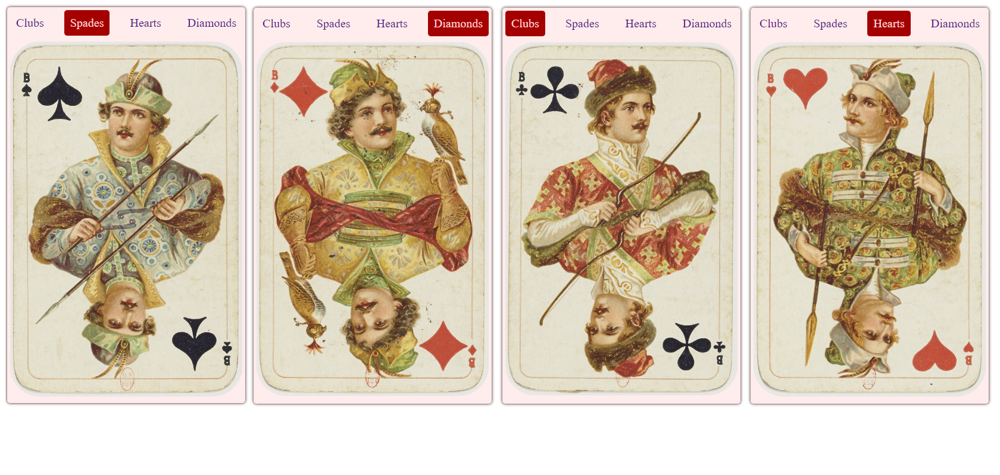

### CSS pseudo element - :target.
####(CSS псевдоэлемент - :target)
---
__Tabs (tabs) for the site are implemented through the pseudo-element "target".__

###### Табы (вкладки) для сайта реализованы посредствам псевдоэлемента "target"(Ru).
---

